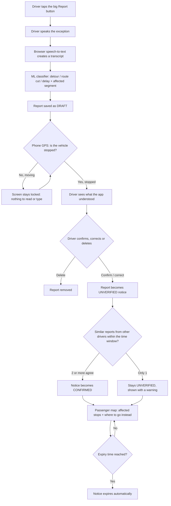
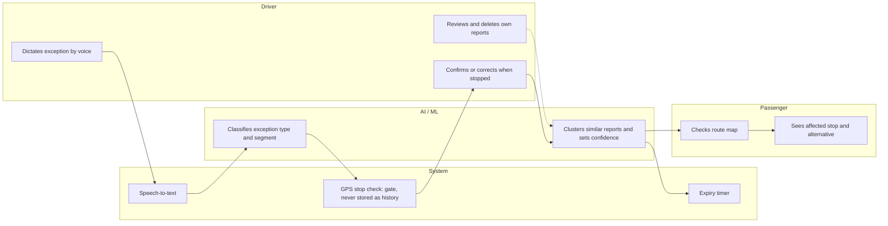

# Off Route — Build Packet (Week 7, Business Bending)

**Declared vacuum (Team 1 Blueprint):** Narrow Driver-knowledge / operational exception information inside informal colectivo operation.
**My role this week:** Money.

---

## 1. Problem, in my words

On the Chalco – Calzada Ignacio Zaragoza colectivo route, the route does not always run the way any map says it does. When there is a protest on Zaragoza, an accident, or a heavy delay, drivers react fast: they take another road, cut the route short, or wait. They do it because time is money and every minute stopped is fare they don't collect.

That reaction lives only in the driver's head. Waze or Google Maps may show that a protest exists, but no map says **what the colectivo does about it**. Meanwhile, passengers wait at stops the micro will skip, with no idea that the route changed.

The route also crosses two jurisdictions (Estado de México and CDMX), so neither government has the full picture of how it actually operates day to day.

## 2. Exact user

- **Primary user:** a colectivo driver on one pilot route (Chalco – Calzada Zaragoza) who reports operational exceptions by voice while working.
- **Secondary user:** passengers of that route who check today's exceptions before or while waiting at a stop.

## 3. Success definition

> Before the module closes, a driver dictates a detour, confirms it while stopped, and a passenger sees on the map that their stop has no service and where to go instead.

## 4. Mockup (image-generated)

*Generated with the LLM's image generation from this description:* a two-panel mobile app screen. Left panel, "Driver" view: a large round microphone button labeled "Report", a banner "Vehicle moving — confirm when stopped", and a draft card reading "Detour: protest on Calzada Zaragoza, taking alternate road A". Right panel, "Passenger" view: a map of a route line from Chalco to Calzada Zaragoza, two stops greyed out with a "No service now" label, a dashed detour line, and a card "Walk to Stop 7 — service resumes there. Confirmed by 3 drivers · expires in 2 h". A small "SIMULATED DATA" tag at the top.

## 5. The flow

### 5.1 Flowchart — how the feature works

### 5.2 Swimlane — who does what

## 6. Benchmark line

- **The best existing solution on Earth for this is** Ma3Route (Nairobi), which crowdsources traffic and matatu reports from the public. (Digital Matatus mapped Nairobi's routes, and CDMX's 2016 Mapatón mapped concessioned routes, but both produced static maps.)
- **Mine differs by** getting the report from the driver who holds the knowledge, verifying and expiring it, and telling passengers what the route does in response (detour, cut, delay), not just that an event happened, without ever turning that data against the driver.

## 7. Long view (3 years)

In three years, Off Route covers the main colectivo corridors between Estado de México and CDMX. Both governments pay for route-level exception data to plan detours, stops and service, the honest, updated measurement the 2017 mobility survey no longer provides. Drivers' reports are sold only as aggregated route data, never as individual records that could be used to fine or discipline them.

**Money model (future, not built this week):** the app is free for drivers, because their payoff is the information other drivers report (less time lost, more fares). The government pays for aggregated route data. Part of that payment could return to the whole route, split equally among participating drivers, never per report, so nobody profits from inventing reports and nobody is tracked individually.

**My dissent, kept visible:** this slice tests whether driver information has value. It does not prove that information fixes the deepest cause of unsafe colectivo behavior; compensation and ownership incentives (la cuenta) may sit further upstream.

## 8. Blueprint conditions → how this slice honors them

| # | Condition | How Off Route honors it |
|---|---|---|
| 1 | Residual value vs. existing baseline | Reports the route's *reaction* (detour, cut, where to walk), which Waze/Google do not provide; not the event itself |
| 2 | Changes an observable outcome | Passenger sees their stop has no service and where to go instead |
| 3 | Verification, correction, expiration | Draft → driver confirmation → multi-driver confirmation; every notice expires |
| 4 | One bounded route, voluntary group | Only Chalco – Calzada Zaragoza; drivers opt in with sign-in |
| 5 | **Shadow clause: worker-data boundary** | No driver score, ranking or evaluation. Passenger and aggregate views never show who reported. GPS is used only as a live "stopped?" gate and is never stored as history. No police-checkpoint category |
| 6 | Driver stays in governance | "My reports" screen: the driver sees, edits and deletes everything tied to them |
| 7 | Maintenance ownership before scale | Expiry and confidence rules are automatic; the packet makes no scale claims |

## 9. Scope cut — what I am NOT building

- No real drivers, no real routes data: all route geometry, stops and reports are **simulated and labeled on screen**.
- No payments, commissions or per-report rewards.
- No government dashboard or data sales.
- No police-checkpoint reporting category.
- No continuous location tracking or trip history.
- No native app: a mobile-first web app only.
- No routes other than the pilot route.

## 10. Architecture + stack

| Layer | Choice (free tier) | Why |
|---|---|---|
| Frontend | Next.js (App Router) on Vercel | Same stack as previous weeks, free deploys |
| Auth | Supabase Auth, Sign in with Google | Security floor: drivers' reports are personal data |
| Database | Supabase Postgres with Row Level Security | Each driver reads/edits only their own reports |
| Public passenger view | Postgres view exposing only non-identifying fields (type, segment, status, expiry) | Shadow clause: passengers never see who reported |
| Map (geodata) | Leaflet + OpenStreetMap tiles | Free, no API key |
| Voice | Browser Web Speech API | Free; works best in Chrome |
| Phone telemetry | Browser Geolocation API (speed) | Gates the confirm screen while moving; not stored |
| ML | Lightweight text classifier trained on labeled simulated phrases + proximity/time clustering for confidence | Runs in the app, no paid API; outputs labeled as model estimates |

**Data model (simplified)**
- `off_route_reports`: id, driver_id, transcript (max 280 chars), type, segment_id, status (draft / unverified / confirmed / expired), created_at, expires_at.
- `route_segments` and `stops`: simulated geometry for the pilot route.
- `public_notices` (view): type, segment, affected stops, alternative stop, status, expires_at. No driver_id.

## 11. Test plan

| # | Test | Expected result |
|---|---|---|
| 1 | Sign in with Google as a driver | Driver screen loads; passenger map works without sign-in |
| 2 | Dictate "protest on Zaragoza, taking alternate road" | Transcript appears; classified as Detour on the right segment |
| 3 | Simulate vehicle moving | Confirm screen stays locked |
| 4 | Simulate vehicle stopped | Driver can confirm, correct or delete the draft |
| 5 | One driver confirms | Passenger map shows notice as UNVERIFIED with warning |
| 6 | Second simulated driver reports the same thing | Notice becomes CONFIRMED |
| 7 | Expiry time passes | Notice disappears from the passenger map |
| 8 | Driver B tries to read Driver A's reports | Blocked by RLS |
| 9 | Passenger view / public_notices | No driver name, email or id visible anywhere |
| 10 | Input validation | Transcript over 280 chars or empty is rejected |
| 11 | Voice unsupported (e.g., some Safari versions) | Fallback: type the report, same confirm-while-stopped rule |

## 12. Security floor checklist

- [ ] No secrets in the repo: Supabase keys only in Vercel environment variables.
- [ ] Auth: Sign in with Google for drivers.
- [ ] RLS on for `off_route_reports`.
- [ ] Every form validates input (length, type).
- [ ] Only invented data, labeled "SIMULATED DATA" on screen.
